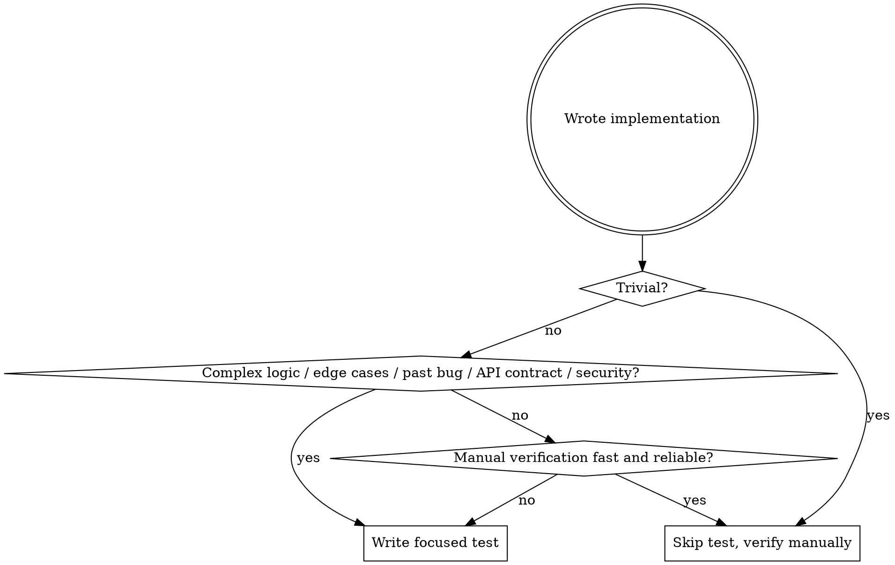

# Pragmatic Testing

## Overview

**Default: write implementation first. Add tests only when they earn their keep.**

Tests are code. Code has cost: writing, reading, maintaining, debugging when they break for reasons unrelated to the system under test. The question is never "is testing good?" — it's "does this specific test, right now, repay its cost?"

This skill replaces test-first dogma with a deliberate decision: write the implementation, then ask "is a test worth it here?"

## Core Principle

**Implementation first. Tests when they pay rent.**

Skip tests for:
- Trivial code (one-liners, getters, glue, config)
- Throwaway scripts and one-shot operations
- UI tweaks better verified by running the app
- Code already covered by an integration test that exercises the same path
- Prototypes / spike code that may be deleted within hours

Write tests for:
- **Complex logic** — algorithms, state machines, parsers, anything where you can't hold all branches in your head
- **Edge cases hard to verify manually** — boundary conditions, off-by-ones, time-zone math, floating-point comparisons
- **Regression prevention for real bugs** — bug appeared once → write a test before/with the fix so it can't silently come back
- **Public API contracts** — anything other code depends on, where breakage is hard to spot
- **Security-sensitive code** — auth, input validation, parsers exposed to untrusted input

## Decision Flowchart

## When You DO Write a Test

Keep it focused and practical. No boilerplate-heavy suites for simple functions.

**Good test traits:**
- Tests behavior, not implementation details
- Fails for one reason — clear what broke
- Runs fast (< 1s for unit, seconds for integration)
- Reads top-to-bottom: arrange → act → assert
- Names describe the behavior under test, not the function name

**Bad test traits (avoid):**
- Asserts on internal state instead of observable behavior
- Mocks so much that it tests the mocks, not the code
- Tests cover trivial paths the type system already enforces
- Snapshot tests on volatile output
- Tests that have to change every time the implementation changes (unless the spec changed)

See `testing-anti-patterns.md` in this directory for the full list of patterns to avoid.

## Regression Tests for Real Bugs

When a bug surfaces and you fix it:

1. **Reproduce the bug first** — confirm you can trigger it
2. **Write a test that fails because of the bug** — run it, confirm it fails for the right reason
3. **Apply the fix**
4. **Run the test — it now passes**
5. **Optional sanity check:** revert the fix, watch the test fail again, restore the fix

This is the one place test-first earns its keep unconditionally: a regression test that wasn't proven to fail before the fix is worthless.

## Verification Without Tests

For everything where you skipped a formal test, you still owe verification before claiming completion:

- **CLI / script:** run it with realistic input, read the output
- **UI change:** open the app, click through the flow, check edge cases
- **API change:** hit the endpoint, inspect the response
- **Build / type changes:** run the typecheck and build, exit code 0

See `superpowers:verification-before-completion` — it applies whether or not tests exist.

## Red Flags — STOP and Reconsider

If you catch yourself thinking:
- "I'll add tests later" — you won't, and even if you do, the implementation will already be shaped by untested assumptions
- "The function is too simple to test" — for genuinely trivial code this is correct; for "simple" code with branching or state, it's a rationalization
- "I'll just test through the UI manually each time" — fine for one-shot, dangerous for code that will change repeatedly
- "Tests would just duplicate the implementation" — that's a sign your "test" is the wrong shape, not that no test belongs here. Test the behavior, not the code
- "This is critical infrastructure but it's hard to test" — invest the time. Critical + untested is the worst combination

## Common Rationalizations

| Excuse | Reality |
|--------|---------|
| "TDD is the only honest way" | Test-first is one technique, not a moral requirement. Pick tests deliberately |
| "More tests = more quality" | Bad tests reduce quality. They lock in implementation details and rot |
| "I'll skip tests, it's just a prototype" | Prototypes that ship become production. If it might ship, ask the rent question |
| "100% coverage is the goal" | Coverage measures lines hit, not behavior verified. Optimize for confidence, not percentage |
| "Mock everything for unit purity" | Heavy mocking tests the mocks. Prefer narrower units over deeper mock chains |

## Integration With Other Skills

- **superpowers:systematic-debugging** — Phase 4 calls for a failing reproduction. Use a test if the system is testable; a one-off repro script otherwise
- **superpowers:verification-before-completion** — every completion claim still requires running verification, with or without tests
- **superpowers:writing-plans** — plans should specify which tasks warrant tests and which don't, instead of mandating test-first universally

## The Bottom Line

**Tests are an investment. Make the investment when it pays.** Don't skip them out of laziness; don't pile them up out of dogma. Default to writing the implementation first, then ask whether a test here is the highest-leverage thing you could add.
